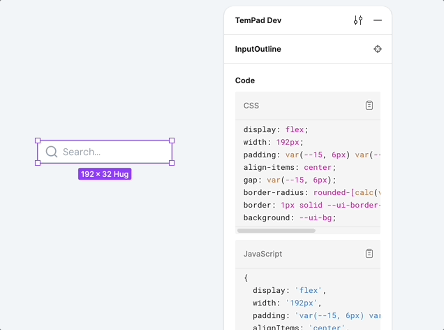

<!-- markdownlint-disable MD033 -->

# tempad-dev-plugin-nuxt-ui

Nuxt UI plugins for [TemPad Dev](https://github.com/ecomfe/tempad-dev).

This plugin allows you to view component code, specifically tailored for Nuxt UI.

<picture>
  <source media="(prefers-color-scheme: dark)" srcset="assets/hero-dark.gif">
  <source media="(prefers-color-scheme: light)" srcset="assets/hero-light.gif">
  
</picture>

## Installation

1. Install [TemPad Dev](https://chromewebstore.google.com/detail/tempad-dev/lgoeakbaikpkihoiphamaeopmliaimpc) from Chrome Web Store.

2. Install `@nuxt` in TemPad Dev's plugins section.

## Features

- **Component Codegen**: Convert design components to [Nuxt UI](https://ui3.nuxt.dev/) code.

  e.g. `InputOutline` to `<UInput>`:

  ```vue
  <UInput placeholder="Search..." icon="i-lucide-search" />
  ```

## License

[MIT](./LICENSE) License © 2025-Present [GU Yiling](https://github.com/Justineo)
